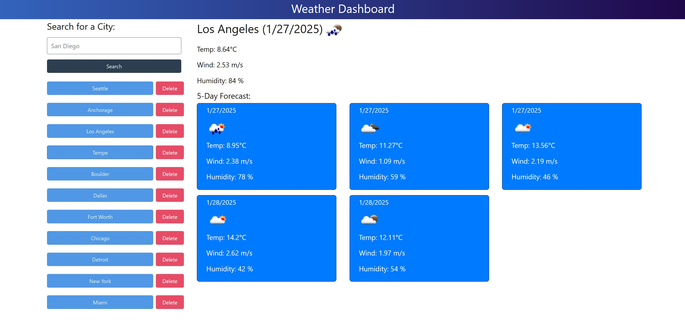

  # Weather Dashboard 1.0
  

  ## Description
  This is a deployed application that allows a user to search for a city by name and receive current and forecasted weather data. The app also retains a search history that can be used to easily pull updated weather data and also permits removing past searches.

  Deployment URL:
  https://weather-dashboard-fv9t.onrender.com/

  ## Table of Contents
  - [Installation](#installation)
  - [Usage](#usage)
  - [License](#license)
  - [Contributing](#contributing)
  - [Tests](#tests)
  - [Questions](#questions)

  ## Installation
  This project requires no installation, as it is hosted at the URL provided under "Description".

  ## Usage
  Use the searchbar to search for a city. Remove past searches by clicking the "Delete" button associated with the previous search to be removed.
  
  
  

  ## License
  This project is licensed under the MIT license. For more details, see the license link: (https://opensource.org/licenses/MIT)

  ## Contributing
  As this is a project strictly for educational purposes, no contributions will be accepted.

  ## Tests
  There are currently no tests implemented in this program at this time.

  ## Questions
##### For any questions regarding this project, contact the project owner via: 
  GitHub: [apoborka](https://github.com/apoborka)\
  Email: alex.poborka@example.com

  ## Acknowledgments
  This project utilized GitHub Copilot.
  Starter code was provided by EdX.
  This project utilizes the [OpenWeatherAPI](https://openweathermap.org/api) for all weather data.
  